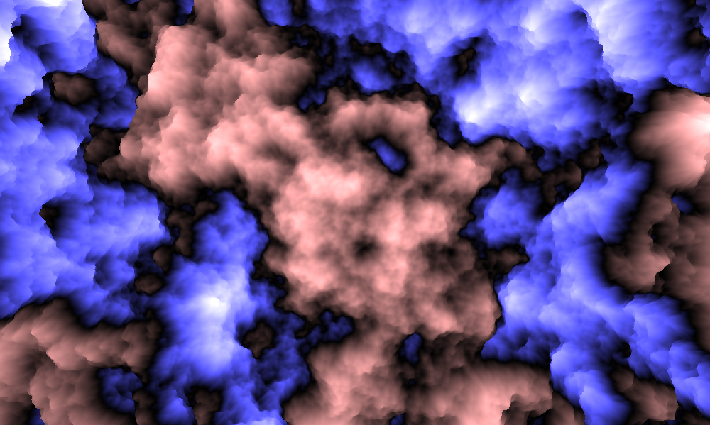
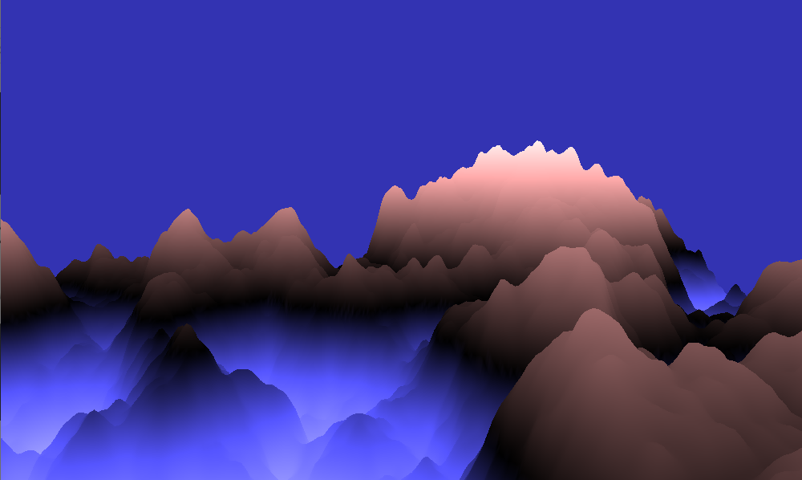

# perlin-terrain
Investigation into Perlin Noise and its applications in terrain generation

An aerial view of the generated terrain.

A side-on view of the generated terrain.

# Overview
This is an example of the terrain that can be generated with Perlin Noise. Little is done in terms of optimisation but this will be worked upon in subsequent projects.

# The Map
The map consists of a square mesh with the camera positioned in the middle. The noise value at each point becomes the y value of that vertex. The map is coloured so that it becomes a lighter red at higher elevation and a lighter blue at larger negative elevations.

# Movement
Instead of the camera position actually along either the x or z planes, movement is simulated by changing an offset along each of those planes. This offset is fed into the noise function and gives the appearence of movement whereas this is just due to the characteristic similarites between close points in the noise function. The ineffiencies in the algorithm come mostly from this movement procedure as every single vertex is updated even though the majority of them were in the mesh before and are just offset. Removing this movement feature and instead using chunking would almost certainly increase performance drastically.
